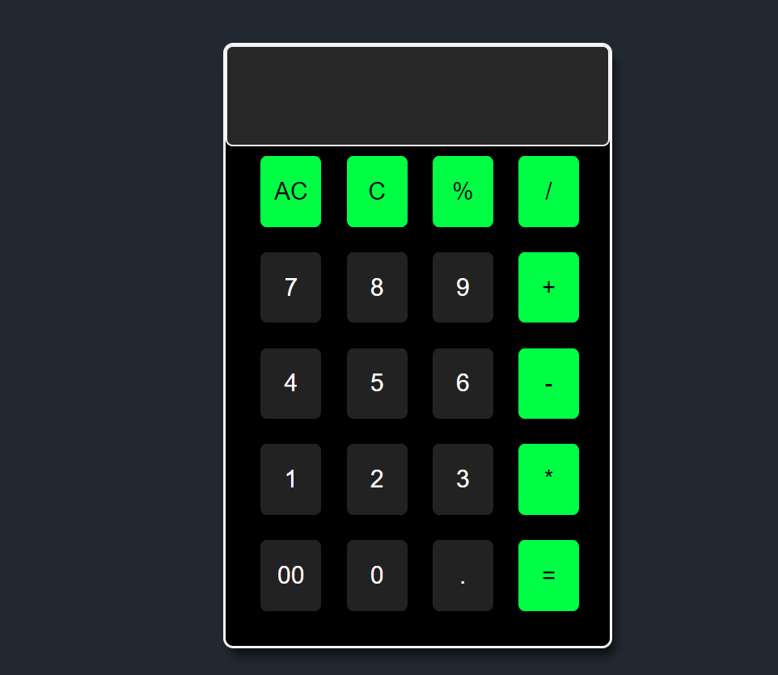
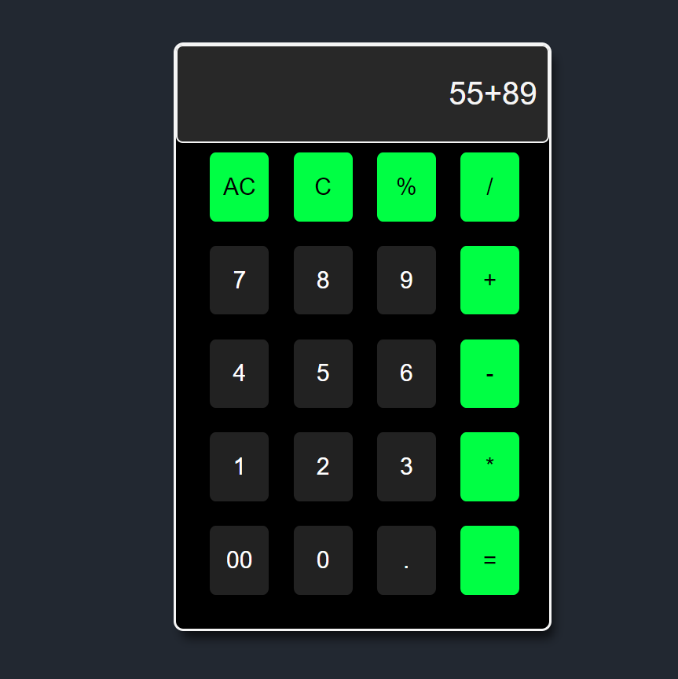
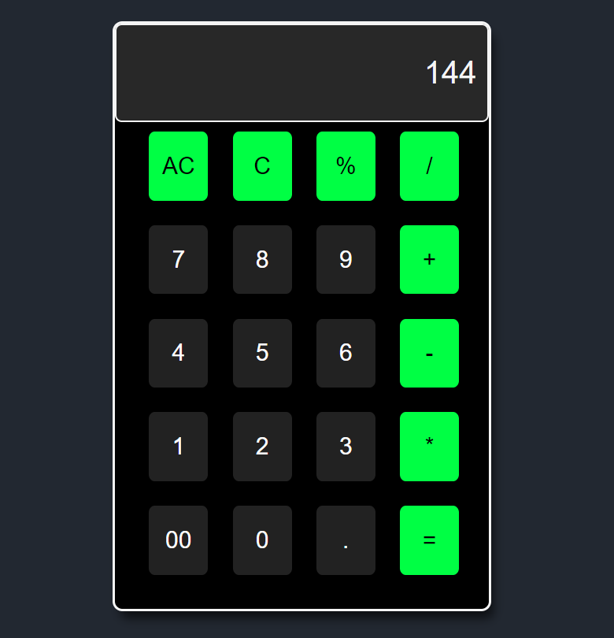

# Calculator
### This is a simple visualization project made using javascript 
- Addition
- Substraction
- Multiplication
- Divide

### This is built using HTML, CSS, JavaScript  

[Check out the website here](https://calculator-2212.netlify.app/)

  
  
  
